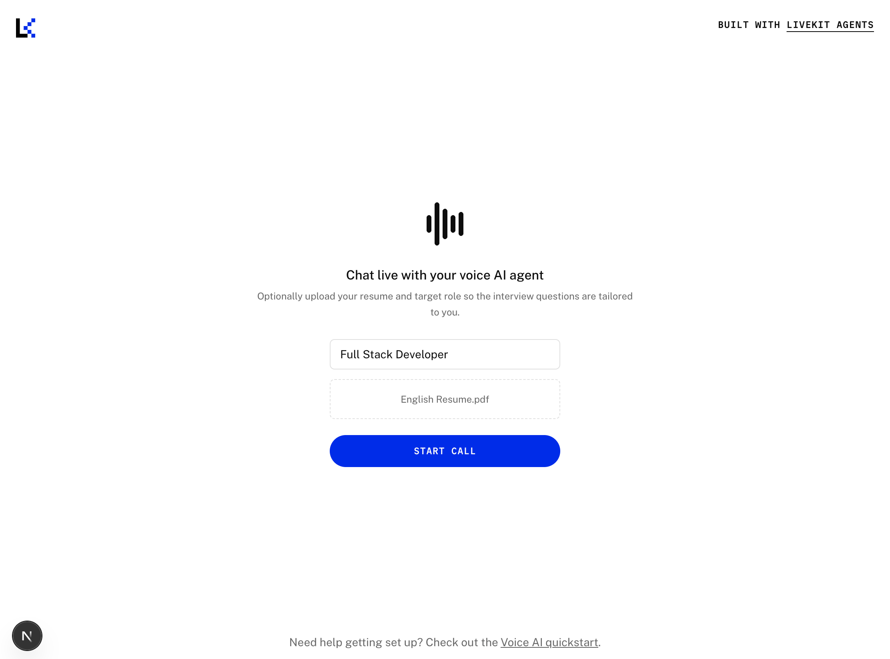
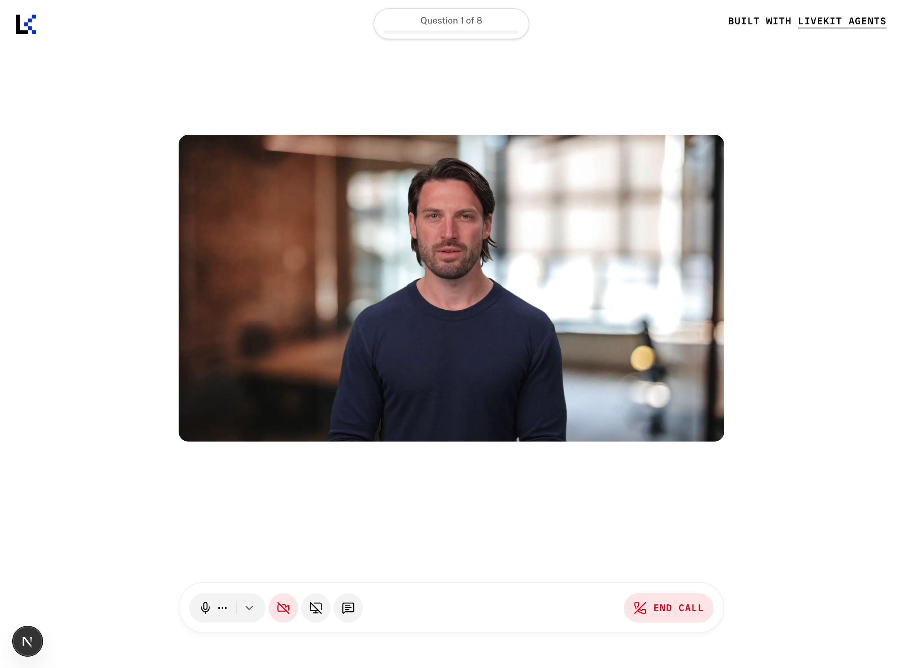
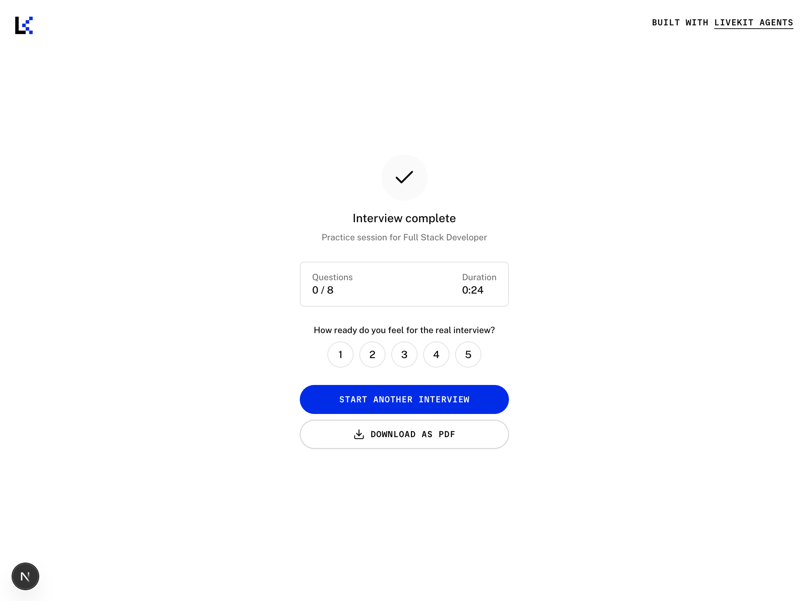

# Live Interview Voice Agent

An AI mock-interview platform: upload your resume, tell it the role you're targeting, and
practice face-to-face (video + voice) with an AI interviewer whose questions are grounded in
your actual resume and adapt to how you answer — instead of a fixed script or generic FAQ list.

## Demo

| Setup | Interview session | Summary |
|---|---|---|
|  |  |  |

## Problem

Job seekers preparing for interviews don't have a good way to practice based on their own
resume. Existing AI interview simulators mostly offer generic, one-size-fits-all questions —
they don't let you upload a CV and get questions actually grounded in it.

## How it works

1. Candidate uploads a resume (PDF) and enters a target job title.
2. The agent parses the resume and generates an initial question set grounded in it
   (behavioral, technical, role-specific, project deep-dive) — or a role-aware generic set if
   no resume was uploaded.
3. A synced AI avatar (video, not just audio) asks the questions face-to-face; the candidate's
   own camera is on too, so it's a real two-way video call, not a one-way broadcast.
4. The candidate's speech is transcribed and used to drive the conversation. After each answer,
   the agent decides whether to dig deeper on the same topic or move on — the follow-up
   question is generated from what the candidate actually said, not a fixed script.
5. After a fixed number of turns, the candidate lands on a summary screen: stats, self-rated
   readiness, the full question/answer transcript with per-question feedback, and a
   "Download as PDF" export.

## Tech stack

- **Frontend** — Next.js + [`@livekit/components-react`](https://github.com/livekit/components-js)
- **Backend** — Python, [LiveKit Agents SDK](https://github.com/livekit/agents) (STT → LLM → TTS
  voice pipeline, orchestrated as a `livekit-agents` worker)
- **Avatar** — [Beyond Presence](https://www.bey.dev/) (`bey.AvatarSession`), a synced talking-head
  video avatar joined into the same LiveKit room
- **Models** — via [LiveKit Inference](https://docs.livekit.io/agents/models/inference/):
  AssemblyAI (STT), an LLM (interview logic, resume-grounded question generation, adaptive
  follow-ups, transcript feedback), Fish Audio (TTS)

```
 Candidate's browser                     Python agent worker
 (camera + mic)                          (livekit-agents)
        │                                        │
        │        LiveKit Cloud room              │
        ├───────────audio/video──────────────────┤
        │                                         │
        │                              STT → LLM → TTS pipeline
        │                                         │
        │                              Beyond Presence avatar
        │◄─────synced avatar video/audio──────────┤
        │                                         │
        │◄──data messages (progress, transcript,──┤
        │    resume-parse status, summary)        │
```

## Features

- Resume upload (PDF, drag-and-drop) → CV-grounded, role-specific interview questions, with a
  role-aware generic fallback if no resume is provided
- Adaptive follow-up questions based on the candidate's actual answers, not a fixed script
- Two-way video: candidate camera + a synced, talking AI avatar
- The avatar speaks first and won't re-ask for a role you already gave it in the setup form
- Live progress indicator, full transcript, and per-question feedback generated after the
  interview wraps up
- Self-rated readiness + one-click PDF export of the session summary
- Graceful degradation: falls back to voice-only if the avatar fails to join, to generic
  questions if the resume can't be parsed (with a status toast either way), and still shows a
  partial summary (with whatever was answered so far) if the candidate disconnects mid-interview

## Getting started (local)

You'll need [`uv`](https://docs.astral.sh/uv/), [`pnpm`](https://pnpm.io/), a
[LiveKit Cloud](https://cloud.livekit.io/) project, and a [Beyond Presence](https://app.bey.dev/)
account.

### 1. Backend agent worker

```bash
cd backend/my-agent
cp .env.example .env.local   # fill in LIVEKIT_URL / LIVEKIT_API_KEY / LIVEKIT_API_SECRET / BEY_API_KEY
uv sync
uv run python src/agent.py dev
```

### 2. Frontend

```bash
cd frontend
cp .env.example .env.local   # same LiveKit keys, plus AGENT_NAME=my-agent
pnpm install
pnpm dev
```

Open `http://localhost:3000`, allow camera/mic access, and start a session.

## Testing

```bash
cd backend/my-agent
uv run pytest
```

## Known limitations

- **English only.** Speech-to-text, the system prompts, the TTS voice, and the frontend UI are
  all hardcoded to English. Multi-language support is a possible future direction, not
  currently built.
- **Follow-up depth isn't role- or coverage-aware.** After each answer, a single LLM call
  decides "dig deeper" vs. "move on" using only that one question and answer — it doesn't know
  the target role, and there's no cap on how many consecutive follow-ups can happen on the same
  topic. In practice this means the interview can sink its whole question budget into one
  project instead of covering the resume, and can chase technical depth that isn't actually
  relevant to a non-technical role (e.g. probing deep into a throwaway "used Python for some
  data processing" line on an operations resume). Fix direction: cap consecutive follow-ups per
  topic, and pass the target role into that decision so it can weigh relevance, not just
  answer completeness.
- **Not deployed.** This runs locally against LiveKit Cloud + Beyond Presence; it isn't hosted
  anywhere public.

## Project structure

```
backend/my-agent/src/
  agent.py            # AgentSession wiring, InterviewerAgent, avatar + STT/LLM/TTS setup
  interview_flow.py    # per-question ask/evaluate task, follow-up decision, transcript feedback
  resume_parser.py     # PDF text extraction + CV-grounded / role-aware question generation
backend/my-agent/tests/  # pytest suite using the LiveKit Agents testing framework

frontend/components/app/
  welcome-view.tsx      # Setup screen (job title + resume upload)
  preparing-view.tsx     # connecting spinner
  view-controller.tsx    # phase state machine + LiveKit data-channel wiring
  summary-view.tsx       # stats, transcript, PDF export
```
